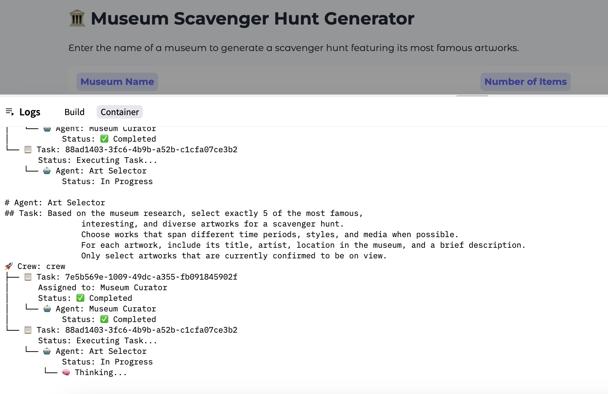
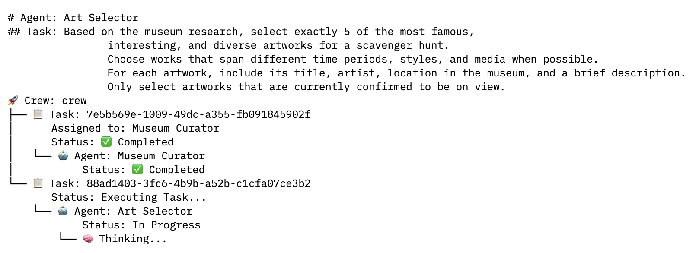

## 🎯 What is this?

This app generates engaging **museum scavenger hunts** featuring real artworks currently on view, complete with clues and historical context — perfect for museum visitors, students, and art lovers!

- 🌐 **Live Demo:** [Hugging Face Space](https://huggingface.co/spaces/ek0212/museum-scavenger)
- ⚙️ **Built with:** [CrewAI](https://github.com/joaomdmoura/crewAI), Gradio, and Hugging Face Spaces

## ✨ Features

- 🔍 Curates scavenger hunts for any museum, using multiple AI "agents" (CrewAI)
- 🖼️ Finds real, on-view artworks and delivers vivid clues and backstories
- 🤝 Designed for educators, families, museum fans, and event organizers
- 🦾 Powered by CrewAI for agent-based teamwork: curator, art selector, art historian, and scene describer

## 🚦 Progress Display Note

> **ℹ️ On Hugging Face Spaces, you can currently only view step-by-step progress in the _Space logs_ (found under the "Logs" tab) — not directly in the app interface. The final scavenger hunt result will display in the app when complete.**
### Demo Images

## 🚀 How it Works

1. **Enter a museum name** (e.g. "Louvre Museum")
2. **Choose the number of items** for your scavenger hunt
3. **Get a custom scavenger hunt** with artwork info, fun facts, and visual clues

Agents collaborate via [CrewAI](https://github.com/joaomdmoura/crewAI) and large language models to generate each hunt.

## 🛠️ Tech Stack

- 🤗 **Hugging Face Spaces** (`gradio`, `fastapi`)
- 🦾 **CrewAI** (multi-agent orchestration)
- 🖼️ **Mixtral-8x7B-Instruct** (via Hugging Face Hub)
- 📝 `gradio` UI
- 🔗 [See requirements.txt](./requirements.txt)
